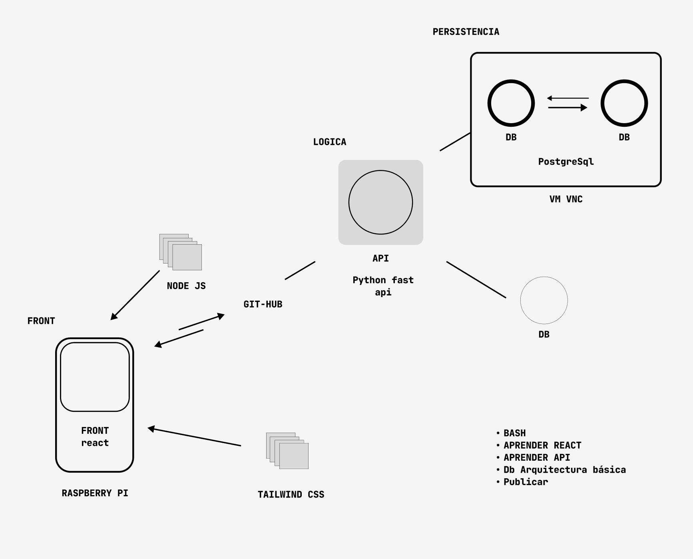

#   Encuestas
> [!NOTE]  
> Arquitectura

> [!TIP]
> Tareas

    - Montar servidor bd
    - Montar servidor api
    - Montar servidor node (react)
    - Crear sh para que se sincronice la rama del front con el servidor
    - Crear una estructura básica de tablas

> [!TIP]
> No subir nada en main
